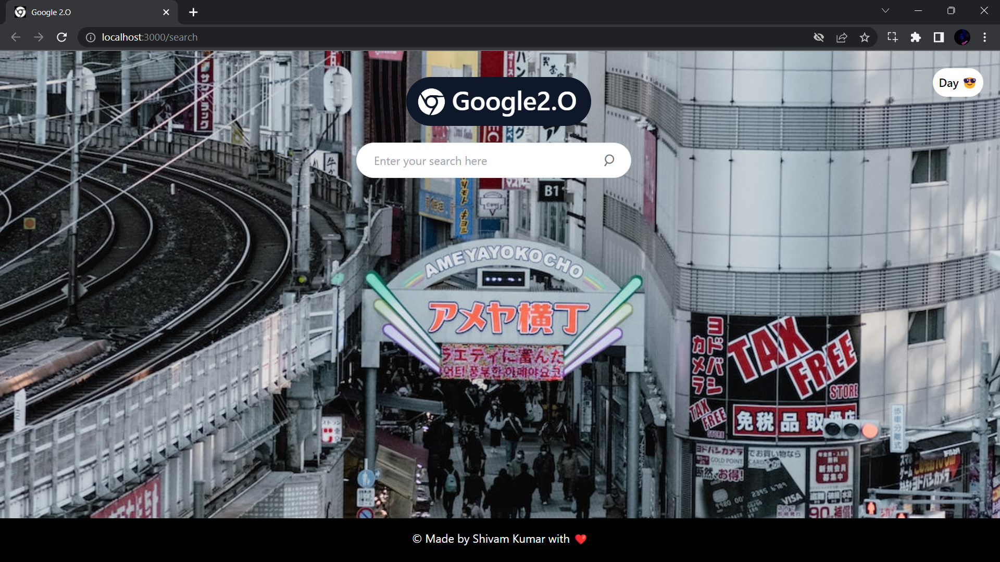

# Project Title
Google 2.O Web Searching App using React Js and Tailwind CSS

## Demo link:
Access my site at [Google2.O](https://itsme-shivamkumar.github.io/Google2.O/)

## Table of Content:

- [About The App](#about-the-app)
- [Technologies](#technologies)
- [Approach](#approach)
- [Screenshots](#screenshots)
- [Setup](#setup)
- [Status](#status)
- [License](#license)

## About The App

 - The app is a clone of Google with some additional features. 
 - It allows users to search the web with ease and convenience. 
 - Upon opening or reloading the page, a new and random background image will greet the user. 
 - The app offers both Light and Dark theme options for better user experience. 
 - Users can also quickly re-search without having to return to the homepage to perform a new search.

## Technologies

 - The app was built using HTML, Tailwind CSS, JavaScript, and ReactJS. 
 - Asynchronous programming was implemented through calling a Realtime-web-search API to get limited (10) web results. 
 - Tailwind CSS was used to style the layout and HTML elements. 
 - The app also utilized hooks like useState(), useEffect(), useDebounce(), useContext(), and useRef() for functionalities and state management. 
 - The loading component of 'react-loader' was used to create the Rings loading animation.

## Approach

 - The app was divided into components such as Navbar, Search, Result, Loading, and Footer. 
 - To manage dynamically changing variables, the ResultContextProvider was created using the useContext() hook of React. 
 - An array of API keys was used, and Math.random function of JavaScript was utilized to pass a random key in the header of the fetch request. 
 - This helped in reducing errors and getting results with less latency, as each API has a monthly limit.

## Screenshots
### Desktop States 
 <b>Homepage(Light Theme)</b>  
  
 <b>Homepage(Dark Theme)</b>  
  
 <b>Active(Light Theme)</b>  
  
 <b>Active(Dark Theme)</b>  
  

### Tablet States 
 <b>Homepage(Light Theme)</b>  
  
 <b>Homepage(Dark Theme)</b>  
  

### Mobile States 
 <b>Homepage(Light Theme)</b>  
  
 <b>Active(Dark && Light Theme)</b>  
   

### Loading Animation 
  

## Setup
- download or clone the repository
- run `npm start`

## Status
[Google2.O] is still in progress. `Version 2` will be out soon with more features like news/videos/images search at one place.

## License
Copyright © 2023 @ [Shivam Kumar](https://github.com/itsme-shivamkumar/)
